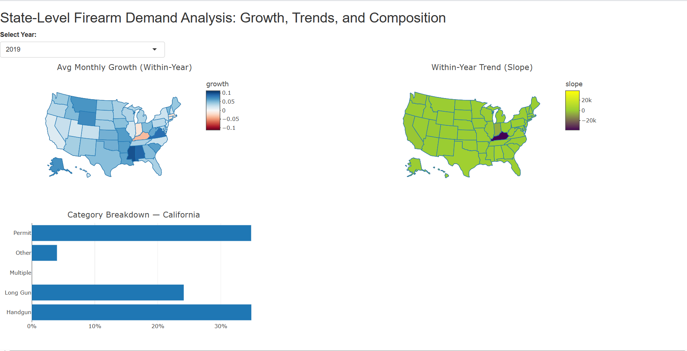

# Firearm Purchase Demand Analysis

## Overview
This project analyses firearm background check data from the FBI's National 
Instant Criminal Background Check System (NICS) covering November 1998 to 
September 2023 across all 50 US states and the District of Columbia. The 
analysis examines state-level demand variation, national trends, compositional 
differences across check types, and deploys an interactive dashboard for 
visual exploration.

**Core research question:** Does the rate of change in firearm background 
checks vary across states, and what structural factors explain that variation?

---

## Dataset
- **Source:** FBI NICS Firearm Background Checks
- **File:** `nics-firearm-background-checks.csv`
- **Coverage:** November 1998 – September 2023
- **Scope:** 51 jurisdictions (50 states + DC), 27 columns, 16,445 rows
- **Key columns:** handgun, long_gun, multiple, permit, other, 
  permit_recheck, admin, prepawn/redemption/returned/private_sale variants, 
  totals

---

## Demand Metric Definition
Raw NICS totals include administrative rechecks, pawn transactions, and 
rentals that do not represent new firearm purchases. A focused demand metric 
was constructed as:

$$demand_checks = handgun + long_gun + multiple + permit + other$$

These five check types represent background checks initiated for new firearm 
ownership. Permit checks are included because some states (Illinois, Hawaii, 
Alabama) route purchases through a permit system rather than direct 
point-of-sale checks, making permit and handgun checks functional substitutes 
in those states (Nemerov, 2018).

Excluded columns and reasons:

| Column | Reason |
|---|---|
| permit_recheck | Administrative recheck of existing permits — no new purchase |
| admin | System-level check — no firearm transaction |
| prepawn / redemption | Pawn transactions — gun already in circulation |
| returned / return_to_seller | Gun going back — not a purchase |
| rentals | No ownership transfer |
| private_sale | Inconsistently reported across states |

---

## Analysis Components

### 1. National Monthly Demand Trend
Time series of aggregated monthly demand checks across all 50 states from 
2019 to 2023. Each year is plotted in a distinct colour to reveal 
within-year seasonality alongside cross-year shifts. The COVID-19 surge 
period (March–December 2020) is highlighted, showing demand nearly doubling 
from the 2019 baseline before gradually returning to pre-pandemic levels 
by 2022–2023.

### 2. PCA Analysis — Structural Group Validation
Principal Component Analysis was conducted on five conceptual groups derived 
from the 24 check-type columns:
- **Purchase demand** — handgun + long_gun + multiple + other + permit
- **Secondary market** — prepawn + redemption transactions
- **Private transfers** — private_sale variants
- **Returns** — returned + return_to_seller variants
- **Rentals** — range rental checks

PC1 (39.6% variance) is dominated by purchase demand, confirming it is the 
primary axis of inter-state variation. Private transfers and returns load 
on PC2 (25% variance), representing a structurally separate dimension. 
California and Texas appear as high-volume outliers on PC1. The biplot 
confirms that purchase demand and secondary market activity are distinct 
behaviours, validating the demand_checks metric construction.

### 3. National Composition of Demand Checks
Annual shares of each check type relative to total NICS checks (2019–2023). 
Handgun share peaked at approximately 31% in 2020 — the highest across all 
five years — consistent with COVID-driven first-time buyer demand. Permit 
share remained structurally stable at 20–29%, reflecting state-level 
administrative routing differences rather than demand changes. Long gun share 
was broadly stable at 17–19%, reflecting existing-owner behaviour.

### 4. Interactive Dashboard
A Shiny dashboard deployed on shinyapps.io providing three interactive panels:

- **Monthly Demand Growth Rate** — choropleth map of average month-over-month 
  growth per state for the selected year (RdBu scale: blue = growth, 
  red = decline)
- **Demand Trend (Regression Slope)** — choropleth map of OLS regression slope 
  fitted to monthly demand within the selected year, capturing sustained 
  directional momentum
- **Category Breakdown** — horizontal bar chart showing check-type composition 
  shares for any clicked state
  
## Dashboard
Interactive Dashboard:
https://rajarajeswari-sankar-data-science-2026.shinyapps.io/nics-firearm/

---

Key findings from the dashboard:
- 2019: Clear geographic variation — Mississippi highest growth
- 2020: Mild uniform positive growth masking the concentrated March surge
- 2021: Near-universal negative growth as demand corrected; Illinois outlier 
  with sustained positive slope
- 2022: Oregon highest growth driven by Measure 114 anticipatory buying; 
  Illinois maintains positive slope for second consecutive year
- 2023: Market stabilising — most states near-zero growth and slope; 
  Illinois reverses sharply to most negative slope
  
---

## Key Findings
1. Firearm demand varies significantly across states and is highly sensitive 
   to policy events, elections, and external shocks
2. The 2020 COVID surge temporarily eliminated inter-state variation — a 
   national shock large enough to override structural differences
3. Illinois consistently shows permit-dominated composition exceeding 80%, 
   reflecting administrative routing rather than genuine demand variation
4. Oregon's 2022 growth spike is directly attributable to anticipatory buying 
   ahead of Measure 114 gun legislation
5. PCA confirms purchase demand is the dominant axis of inter-state variation, 
   validating the demand_checks metric

---

## Technologies
- **R** — tidyverse, lubridate, zoo, broom, ggplot2, ggrepel, plotly, scales
- **Shiny** — interactive dashboard
- **shinyapps.io** — deployment
- **R Markdown** — reproducible report

---

## References
- Nemerov, H.R. (2018). Estimating guns sold by state. *Social Science 
  Research Network*. doi:10.2139/ssrn.3100289
- Bollman, K.M., Hansen, B., Rubin, E., & Stanford, G. (2025). Gun policy 
  and the Steel Paradox: Evidence from Oregunians. *Social Science Research 
  Network*. doi:10.2139/ssrn.5103550
- FBI (2024). NICS Firearm Checks: Month/Year by State/Type. Available at: 
  www.fbi.gov/services/cjis/nics
  

## Dashboard Preview

